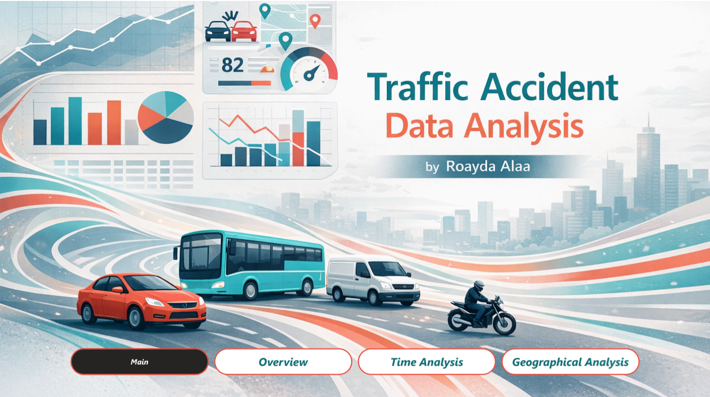
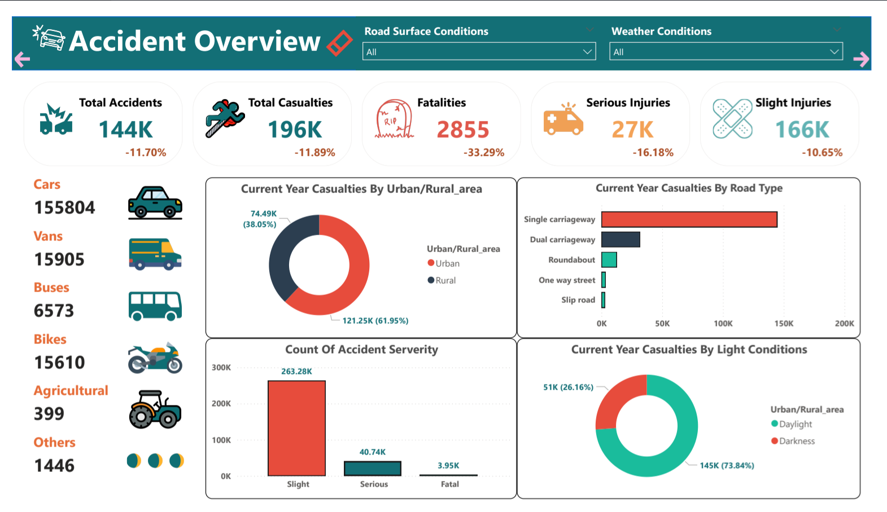
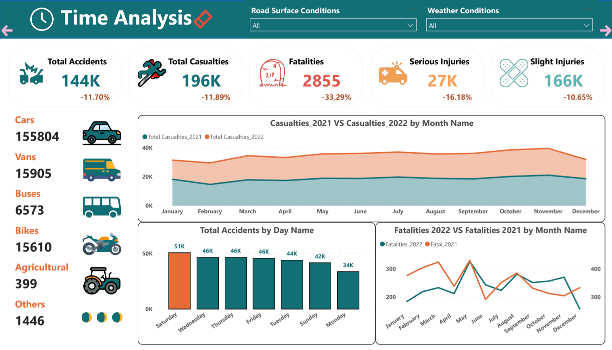
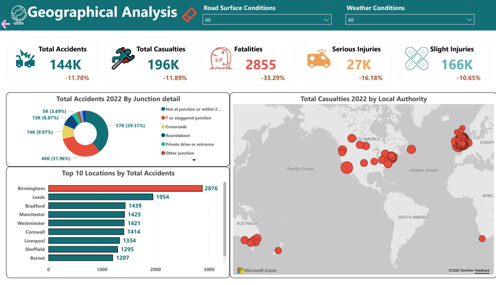

# 🚦 Traffic Accident Data Analysis Dashboard

## 📌 Project Overview
As part of my ongoing journey in Data Analytics with the DEPI program, I built this comprehensive dashboard to uncover critical patterns and the real driving factors behind road accidents. 

My goal was to build a clean and effective analytical pipeline while creating an intuitive, visually engaging interface to present these life-saving insights clearly and challenge common misconceptions about road safety.

## 🎯 Key Accident Metrics Highlighted
* Total Accidents: 144K
* Total Casualties: 196K
* Fatalities: 2,855
* YoY Accident Decline: -11.70%

## ⚙️ Technical Pipeline & Tools
* **Data Cleaning:** Processed and transformed raw data using Power Query (Promoted headers, changed data types with locale, replaced values, added custom columns, and filtered rows).
* **Data Modeling:** Connected the main accident fact table to a custom Calendar table using a 1-to-many relationship for efficient time-based analysis.
* **DAX & Custom Measures:** Organized all calculations into a dedicated `_Measures` table. Wrote DAX formulas to calculate severity rates and year-over-year (YoY) variances using Time Intelligence functions.
* **UI/UX Design:** Implemented a clean, professional color palette and layout to make the data story easy to read and navigate.

## 💡 Key Insights Uncovered
1. **The Human Error Factor:** An overwhelming 80% of accidents occur in perfectly normal weather, and 68% happen on dry roads. This strongly suggests that human behavior is the primary driver of accidents, not environmental factors.
2. **Vehicle Types:** Cars are overwhelmingly the most common vehicle type involved in accidents (over 155K recorded), leaving other vehicles like vans and bikes far behind.
3. **Time Trends:** Total accidents decreased by 11.7% year-over-year. Interestingly, Saturday records the highest number of accidents (51K), followed by consistently high rates from Wednesday through Friday (46K).
4. **Geographical Shift:** Birmingham records the highest number of accidents overall. Under normal conditions, rural areas see the most casualties (65%). However, during extreme weather like snow or floods, the trend flips, with urban areas recording the vast majority of casualties.

## 🖼️ Dashboard Previews

### 1. Main Overview

### 2. Time Analysis

### 3. Geographical Analysis

## 📂 Repository Contents
* `Road_accident.pbix`: The main Power BI file containing the data model, DAX measures, and visualizations.
* `Road_Accidents_Analysis.pdf`: A comprehensive PDF report detailing the dashboard pages and key analysis insights.
* `Media/`: Folder containing the screenshots, images, and a video demonstration of the interactive dashboard.
* `README.md`: Overview of the project and key insights.

---
*Did you uncover any other interesting insights from this data? Feel free to explore the interactive .pbix file and let me know!*
